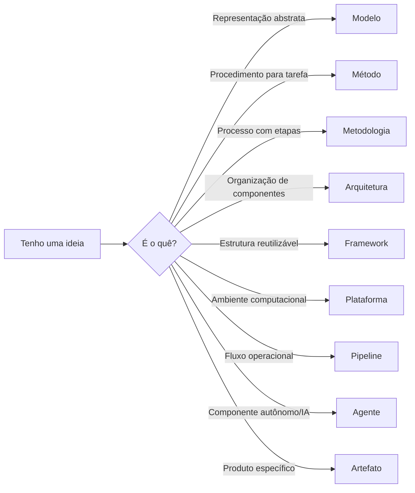

# Como usar este site

Este site foi estruturado para funcionar como uma wiki didática. O aluno pode navegar por tipo de proposta, conceito, fundamento metodológico, artefato, métrica, técnica, problema, aplicação ou trilha de estudo.

## Uso recomendado

1. Identifique o tipo de proposta.
2. Leia os conceitos relacionados.
3. Formalize a lacuna e o objetivo.
4. Defina modelo, arquitetura, módulos ou etapas.
5. Especifique artefatos, metadados e contratos.
6. Implemente ou demonstre o fluxo principal.
7. Planeje validação com métricas, instrumentos e evidências.
8. Organize repositório e documentação.

## Estrutura de decisão

