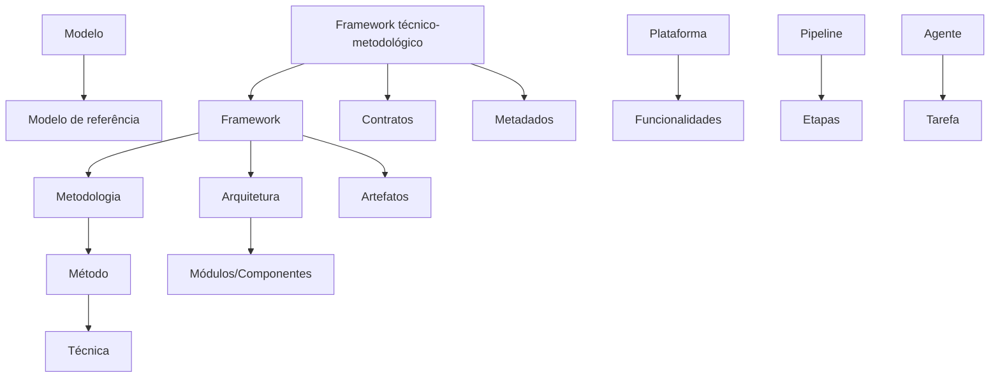

# Conceitos fundamentais

Esta seção reúne os conceitos que sustentam o guia técnico. A precisão conceitual evita que o aluno trate como sinônimos termos que representam níveis diferentes de abstração.

## Relações centrais

## Conceitos em síntese

| Conceito | Síntese |
|---|---|
| Modelo | Representação abstrata |
| Método | Procedimento para tarefa |
| Técnica | Aplicação operacional de método |
| Metodologia | Organização de etapas e critérios |
| Arquitetura | Organização estrutural da solução |
| Pipeline | Sequência operacional de transformação |
| Plataforma | Ambiente computacional com funcionalidades |
| Framework | Estrutura reutilizável para classe de problemas |
| Framework técnico-metodológico | Estrutura técnica + diretrizes metodológicas |
| Artefato | Produto computacional da pesquisa |
