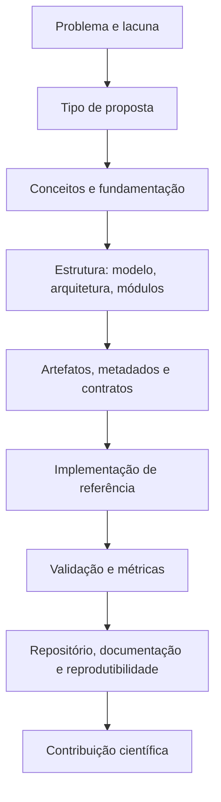

# Guia Técnico-Metodológico para Propostas em Computação

Este site organiza o **Guia Técnico-Metodológico** como uma wiki navegável em formato MkDocs, pronta para publicação no GitHub Pages.

O foco é apoiar alunos e pesquisadores na formalização, implementação, documentação, validação e avaliação de propostas em Ciência da Computação, incluindo:

- modelos e modelos de referência;
- métodos e técnicas;
- metodologias;
- arquiteturas;
- frameworks e frameworks técnico-metodológicos;
- plataformas;
- pipelines;
- agentes inteligentes;
- artefatos computacionais.

!!! tip "Ideia central"
    Uma proposta madura em Computação não é apenas uma ideia ou uma figura: ela precisa estar **formalizada, implementada ou demonstrada, documentada, validada, rastreável e reprodutível**.

## Mapa geral do guia

## Como navegar

- Comece por [Tipos de proposta](tipos/index.md) para identificar o que está sendo proposto.
- Consulte [Conceitos fundamentais](conceitos/index.md) para evitar confusão entre modelo, método, metodologia, arquitetura e framework.
- Use [Do problema ao artefato](problemas/index.md) para transformar uma lacuna em contribuição.
- Use [Artefatos e documentação](artefatos/index.md) para estruturar evidências, metadados e contratos.
- Use [Métricas e validação](metricas/index.md) para planejar a avaliação.
- Use [Trilhas de estudo](trilhas/index.md) para orientar alunos de IC, Mestrado e Doutorado.

## Incorporação do UnespDataLens

O site aproveita a lógica de wiki do UnespDataLens: páginas interligadas para conceitos, métodos, técnicas, problemas, artefatos, métricas, aplicações e trilhas de estudo. Entretanto, o foco deste projeto é o **Guia Técnico-Metodológico**, não um framework específico.
