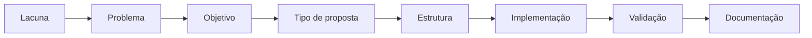

# Do problema ao artefato

A proposta deve nascer de uma lacuna, não de uma figura. A robustez depende da ligação entre problema, lacuna, objetivo, artefato, implementação e avaliação.

```mermaid
flowchart LR
    A[Lacuna] --> B[Problema]
    B --> C[Objetivo]
    C --> D[Tipo de proposta]
    D --> E[Estrutura]
    E --> F[Implementação]
    F --> G[Validação]
    G --> H[Documentação]
```
